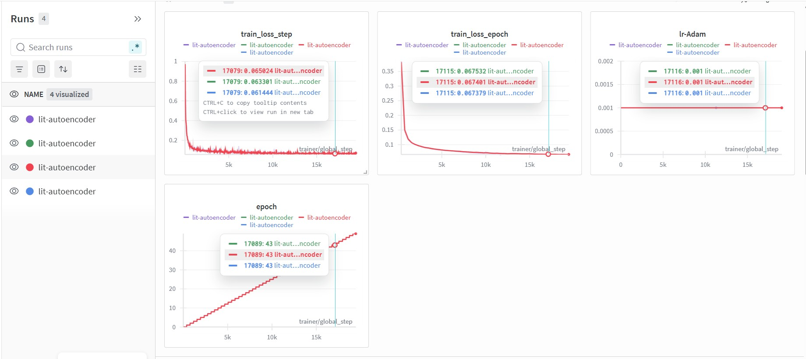
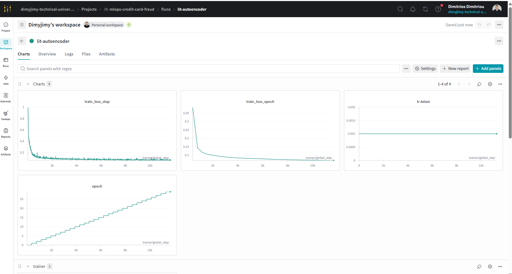
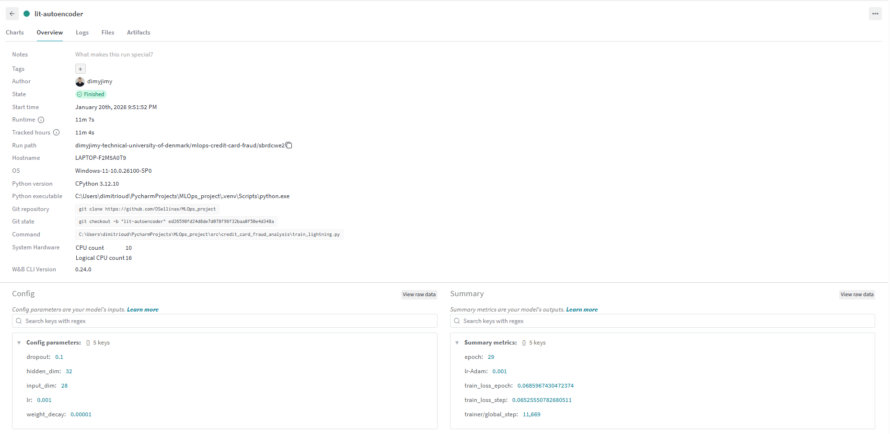
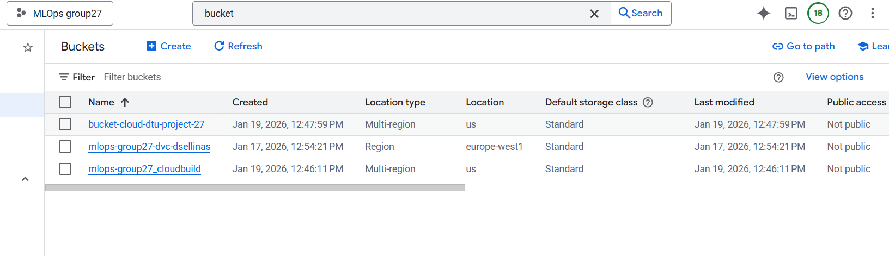
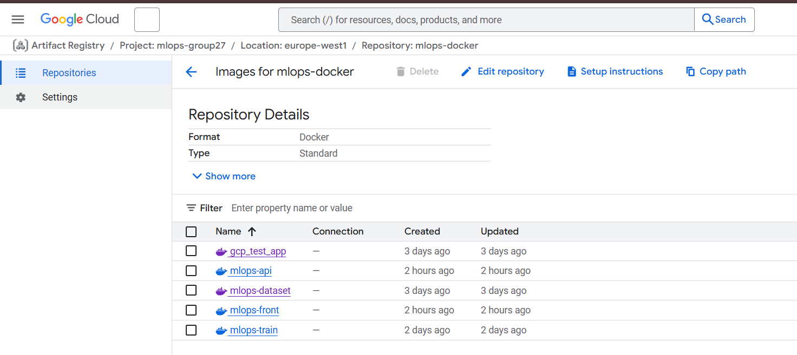
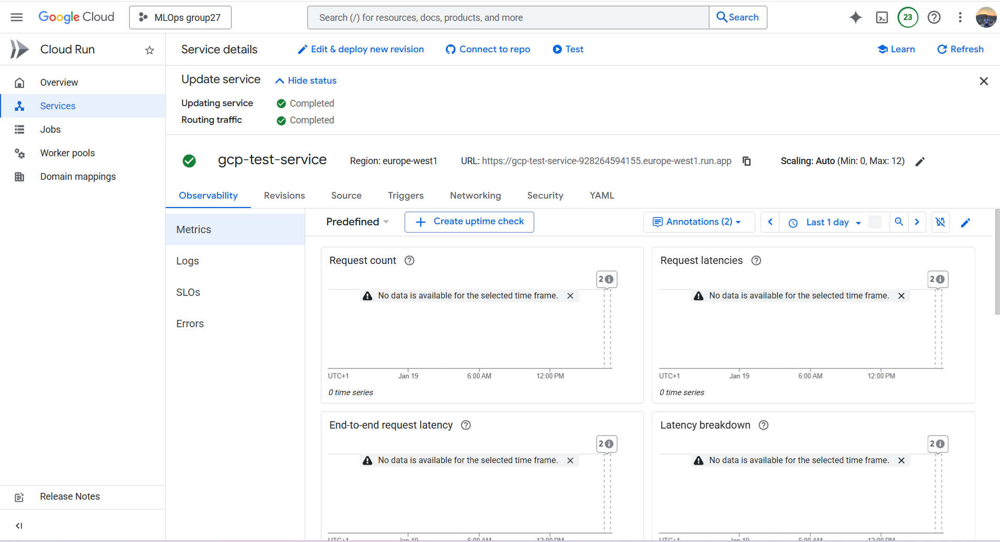
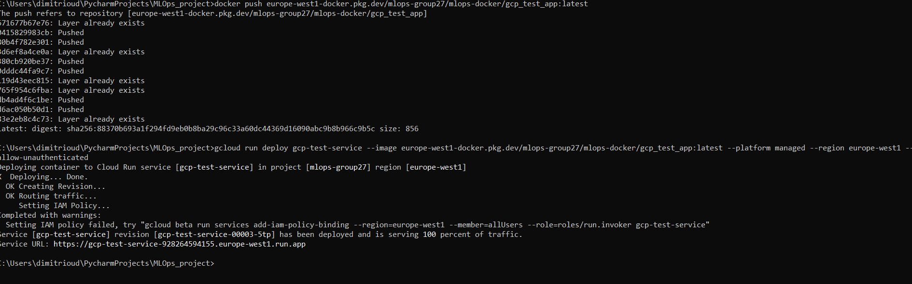
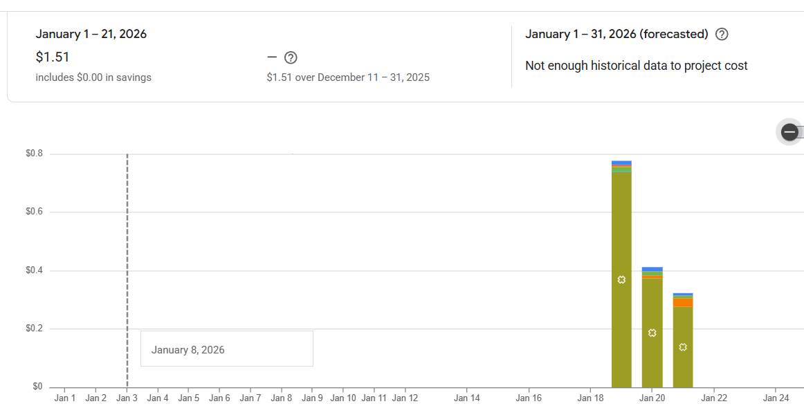

# Exam template for 02476 Machine Learning Operations

This is the report template for the exam. Please only remove the text formatted as with three dashes in front and behind
like:

```--- question 1 fill here ---```

Where you instead should add your answers. Any other changes may have unwanted consequences when your report is
auto-generated at the end of the course. For questions where you are asked to include images, start by adding the image
to the `figures` subfolder (please only use `.png`, `.jpg` or `.jpeg`) and then add the following code in your answer:

``

In addition to this markdown file, we also provide the `report.py` script that provides two utility functions:

Running:

```bash
python report.py html
```

Will generate a `.html` page of your report. After the deadline for answering this template, we will auto-scrape
everything in this `reports` folder and then use this utility to generate a `.html` page that will be your serve
as your final hand-in.

Running

```bash
python report.py check
```

Will check your answers in this template against the constraints listed for each question e.g. is your answer too
short, too long, or have you included an image when asked. For both functions to work you mustn't rename anything.
The script has two dependencies that can be installed with

```bash
pip install typer markdown
```

or

```bash
uv add typer markdown
```

## Overall project checklist

The checklist is *exhaustive* which means that it includes everything that you could do on the project included in the
curriculum in this course. Therefore, we do not expect at all that you have checked all boxes at the end of the project.
The parenthesis at the end indicates what module the bullet point is related to. Please be honest in your answers, we
will check the repositories and the code to verify your answers.

### Week 1

* [X] Create a git repository (M5)
* [X] Make sure that all team members have write access to the GitHub repository (M5)
* [X] Create a dedicated environment for you project to keep track of your packages (M2)
* [X] Create the initial file structure using cookiecutter with an appropriate template (M6)
* [X] Fill out the `data.py` file such that it downloads whatever data you need and preprocesses it (if necessary) (M6)
* [X] Add a model to `model.py` and a training procedure to `train.py` and get that running (M6)
* [X] Remember to either fill out the `requirements.txt`/`requirements_dev.txt` files or keeping your
    `pyproject.toml`/`uv.lock` up-to-date with whatever dependencies that you are using (M2+M6)
* [X] Remember to comply with good coding practices (`pep8`) while doing the project (M7)
* [X] Do a bit of code typing and remember to document essential parts of your code (M7)
* [X] Setup version control for your data or part of your data (M8)
* [X] Add command line interfaces and project commands to your code where it makes sense (M9)
* [X] Construct one or multiple docker files for your code (M10)
* [X] Build the docker files locally and make sure they work as intended (M10)
* [X] Write one or multiple configurations files for your experiments (M11)
* [X] Used Hydra to load the configurations and manage your hyperparameters (M11)
* [X] Use profiling to optimize your code (M12)
* [X] Use logging to log important events in your code (M14)
* [X] Use Weights & Biases to log training progress and other important metrics/artifacts in your code (M14)
* [ ] Consider running a hyperparameter optimization sweep (M14)
* [X] Use PyTorch-lightning (if applicable) to reduce the amount of boilerplate in your code (M15)

### Week 2

* [X] Write unit tests related to the data part of your code (M16)
* [X] Write unit tests related to model construction and or model training (M16)
* [X] Calculate the code coverage (M16)
* [X] Get some continuous integration running on the GitHub repository (M17)
* [X] Add caching and multi-os/python/pytorch testing to your continuous integration (M17)
* [X] Add a linting step to your continuous integration (M17)
* [X] Add pre-commit hooks to your version control setup (M18)
* [X] Add a continues workflow that triggers when data changes (M19)
* [X] Add a continues workflow that triggers when changes to the model registry is made (M19)
* [X] Create a data storage in GCP Bucket for your data and link this with your data version control setup (M21)
* [X] Create a trigger workflow for automatically building your docker images (M21)
* [X] Get your model training in GCP using either the Engine or Vertex AI (M21)
* [X] Create a FastAPI application that can do inference using your model (M22)
* [X] Deploy your model in GCP using either Functions or Run as the backend (M23)
* [X] Write API tests for your application and setup continues integration for these (M24)
* [X] Load test your application (M24)
* [X] Create a more specialized ML-deployment API using either ONNX or BentoML, or both (M25)
* [X] Create a frontend for your API (M26)

### Week 3

* [X] Check how robust your model is towards data drifting (M27)
* [X] Setup collection of input-output data from your deployed application (M27)
* [ ] Deploy to the cloud a drift detection API (M27)
* [X] Instrument your API with a couple of system metrics (M28)
* [X] Setup cloud monitoring of your instrumented application (M28)
* [ ] Create one or more alert systems in GCP to alert you if your app is not behaving correctly (M28)
* [X] If applicable, optimize the performance of your data loading using distributed data loading (M29)
* [ ] If applicable, optimize the performance of your training pipeline by using distributed training (M30)
* [X] Play around with quantization, compilation and pruning for you trained models to increase inference speed (M31)

### Extra

* [ ] Write some documentation for your application (M32)
* [ ] Publish the documentation to GitHub Pages (M32)
* [ ] Revisit your initial project description. Did the project turn out as you wanted?
* [X] Create an architectural diagram over your MLOps pipeline
* [X] Make sure all group members have an understanding about all parts of the project
* [X] Uploaded all your code to GitHub

## Group information

### Question 1
> **Enter the group number you signed up on <learn.inside.dtu.dk>**
>
> Answer:

27

### Question 2
> **Enter the study number for each member in the group**
>
> Example:
>
> *sXXXXXX, sXXXXXX, sXXXXXX*
>
> Answer:

s242973, s242831, s253542, s253560

### Question 3
> **Did you end up using any open-source frameworks/packages not covered in the course during your project? If so**
> **which did you use and how did they help you complete the project?**
>
> Recommended answer length: 0-200 words.
>
> Example:
> *We used the third-party framework ... in our project. We used functionality ... and functionality ... from the*
> *package to do ... and ... in our project*.
>
> Answer:

We used **EvidentlyAI** to perform data drift detection by comparing reference data collected during training with data observed at inference time.

For configuration management, we used **Hydra**, which simplified experiment configuration and enabled clean separation between code and hyperparameters.

We also used **Typer** to implement command-line interfaces for training and evaluation scripts, providing a consistent and user-friendly way to run
project components.

Finally, we used **Weights & Bias** for experiment tracking, enabling logging of training metrics, configuration parameters, and model artifacts, which
supported systematic experimentation and comparison across runs.



## Coding environment

> In the following section we are interested in learning more about you local development environment. This includes
> how you managed dependencies, the structure of your code and how you managed code quality.

### Question 4

> **Explain how you managed dependencies in your project? Explain the process a new team member would have to go**
> **through to get an exact copy of your environment.**
>
> Recommended answer length: 100-200 words
>
> Example:
> *We used ... for managing our dependencies. The list of dependencies was auto-generated using ... . To get a*
> *complete copy of our development environment, one would have to run the following commands*
>
> Answer:

We managed project dependencies using a combination of `pyproject.toml`, `requirements.txt` and the `uv` package manager, which allowed us to maintain a reproducible
and well-defined Python environment. All direct dependencies are declared in `requirements.txt`, while exact, resolved versions are pinned in the
automatically generated `uv.lock` file.

For local development, a new team member recreate the environment by first installing `uv` and then running `uv pip install -r requirements.txt`, which installs all
dependencies exactly as specified in the lock file. Development-specific dependencies, such as testing and linting tools, are included in a separate
dependency file `requirements_dev.txt` to keep the runtime environment minimal.

Dependencies are all preprocedure in containerized environments. The **Dockerfiles** used for training and inference install dependencies directly from the
same dependency specifications, ensuring consistency between local development, continuous integration, and deployment.

### Question 5

> **We expect that you initialized your project using the cookiecutter template. Explain the overall structure of your**
> **code. What did you fill out? Did you deviate from the template in some way?**
>
> Recommended answer length: 100-200 words
>
> Example:
> *From the cookiecutter template we have filled out the ... , ... and ... folder. We have removed the ... folder*
> *because we did not use any ... in our project. We have added an ... folder that contains ... for running our*
> *experiments.*
>
> Answer:

The project was initialized using the official cookiecutter template provided in the course, which defined the overall structure of the repository.
We retained the core layout, including the `src/` directory for source code, `tests/` for automated testing, `configs/` for configuration files, and
`data/` for raw and processed datasets.

The main project logic was implemented inside the `src/credit_card_fraud_analysis` package, including data handling, model definition, training,
evaluation, and an API for inference. The `tests/` directory was extended with unit, integration, and performance tests to validate components
of the pipeline.

We also added a `dockerfiles/` directory containing separate **Dockerfiles** for training, inference, and the API, as well as a **Cloud Build** configuration
for automated training. A `reports/` directory was included for the exam report, and `docs/` was extended with project documentation and profiling
notes.

Overall, the cookiecuter structure was preserve, while additional folders and files were introduced to support deployment, monitoring, and
reproducibility requirements.

### Question 6

> **Did you implement any rules for code quality and format? What about typing and documentation? Additionally,**
> **explain with your own words why these concepts matters in larger projects.**
>
> Recommended answer length: 100-200 words.
>
> Example:
> *We used ... for linting and ... for formatting. We also used ... for typing and ... for documentation. These*
> *concepts are important in larger projects because ... . For example, typing ...*
>
> Answer:

We implemented explicit rules for code quality and formatting to ensure consistency and maintainability through the project. Code style and linting were
enforced using **Ruff**, which was configured in `pyproject.toml` and integrated both as a **pre-commit hook** and as part of our **CI workflows**. This
ensured that common issued such as unused imports, inconsistent formatting, and style violations were automatically detected both locally before commits
and remotely during CI.

Formatting was handled using `ruff format`, keeping a uniform code style across all contributors without relying on manual enforcements.  We did not enforce strict static type checking, we focused on practical documentation and automated quality checks that scale well with project size. These
practices are especially important in larger projects, where multiples contributions worked in parallel, as they reduce technical debt, improve code readability, and prevent errors from propagating unnoticed through the codebase.

## Version control

> In the following section we are interested in how version control was used in your project during development to
> corporate and increase the quality of your code.

### Question 7

> **How many tests did you implement and what are they testing in your code?**
>
> Recommended answer length: 50-100 words.
>
> Example:
> *In total we have implemented X tests. Primarily we are testing ... and ... as these the most critical parts of our*
> *application but also ... .*
>
> Answer:

In total, we implemented **11 test files in total**, covering unit, integration, and performance testing. Unit tests validate critical components such as
data loading, model construction, forward passes, training, evaluation, and configuration handling. We also implemented both API unit tests and API
integrations tests, where the latter explicitly defines testing FastAPI lifespan events, model loading, and error handling for invalid inputs.

Finally, we included a **performance test suite using Locust** to mimic request latency and system behaviour under load.

### Question 8

> **What is the total code coverage (in percentage) of your code? If your code had a code coverage of 100% (or close**
> **to), would you still trust it to be error free? Explain you reasoning.**
>
> Recommended answer length: 100-200 words.
>
> Example:
> *The total code coverage of code is X%, which includes all our source code. We are far from 100% coverage of our **
> *code and even if we were then...*
>
> Answer:

The total code coverage of our project is approximately **45%**. This coverage mainly reflects the parts of the system that are most critical for
the stability of our application, including data preprocessing, model inference, API endpoints, configuration loading, and core utility functions.
Several modules with low or zero coverage correspond to **training scripts, Lightning training pipelines, dataset creation utilities,
and scalability experiments**, which are not executed during normal inference or deployment and are therefore less critical for runtime reliability.

Even if our code had close to 100% coverage, we would not consider it fully error-free. High coverage only indicates that lines of code were executed,
not that all edge cases, failure modes, or logical errors were correctly handled. In particular, integration issues, performance bottlenecks,
numerical instability, and unexpected data distributions can still cause failures despite full coverage. For this reason, code coverage
should be viewed as one quality indicator among others, and it must be complemented by integration tests, monitoring, logging,
and validation on real or adversarial data.

### Question 9

> **Did you workflow include using branches and pull requests? If yes, explain how. If not, explain how branches and**
> **pull request can help improve version control.**
>
> Recommended answer length: 100-200 words.
>
> Example:
> *We made use of both branches and PRs in our project. In our group, each member had an branch that they worked on in*
> *addition to the main branch. To merge code we ...*
>
> Answer:

Our workflow included the use of **branches and pull requests**. During the project, new features and fixes were developed on separate branches instead
of directly on the main branch. Each branch focused on a specific task, such as adding tests, improving the CI pipeline, profiling performance, adding
**Docker** support, or updating dependencies.
When a task was completed, the changes were merged into the main branch using pull requests. This allowed us to review the changes run automated tests,
nd make sure the code worked correctly before merging. The Git history shows several merged pull requests from feature branches, which confirms that
this workflow was actively used.
After the pull requests were merged, the feature branches were removed. This helped keep the repository clean and easier to manage. For example, pre-commit tests and dockerization were fully developed in separate branches before being merged to main.

### Question 10

> **Did you use DVC for managing data in your project? If yes, then how did it improve your project to have version**
> **control of your data. If no, explain a case where it would be beneficial to have version control of your data.**
>
> Recommended answer length: 100-200 words.
>
> Example:
> *We did make use of DVC in the following way: ... . In the end it helped us in ... for controlling ... part of our*
> *pipeline*
>
> Answer:

**DVC** was utilized for managing data in our project. TInstead of storing large datasets directly in Git, raw and processed data are tracked with DVC, while Git only keeps small metadata files such as `data.dvc`. This prevents large data files from bloating the Git repository and keeps version control fast and clean.
We configured a remote DVC storage using **Google Cloud Storage (GCS)**. This ensures that when a specific Git commit is checked out, the corresponding data can be retrieved, allowing experiments to be reliably reproduced since code and data versions are always synchronized.
Additionally, DVC made it easy to track changes in the data, helping determine when retraining or rerunning experiments was necessary. This proved especially valuable as datasets evolved during development.

### Question 11

> **Discuss you continuous integration setup. What kind of continuous integration are you running (unittesting,**
> **linting, etc.)? Do you test multiple operating systems, Python  version etc. Do you make use of caching? Feel free**
> **to insert a link to one of your GitHub actions workflow.**
>
> Recommended answer length: 200-300 words.
>
> Example:
> *We have organized our continuous integration into 3 separate files: one for doing ..., one for running ... testing*
> *and one for running ... . In particular for our ..., we used ... .An example of a triggered workflow can be seen*
> *here: <weblink>*
>
> Answer:

We use GitHub Actions to implement continuous integration (CI) for our project. The CI pipeline is automatically triggered on every `push` and `pull_request` to the
`main` branch, ensuring that all new code is validated against our quality standards before being merged.

Our CI setup is divided into several logical stages to ensure code health. First, we perform linting and formatting checks using
`Ruff`. This allows us to catch syntax errors, unused imports, and style inconsistencies instantly. Following the linting stage, 
we execute our comprehensive test suite using `Pytest`. This includes both unit tests for individual functions and 
integration tests to verify that our machine learning components work together seamlessly.

To ensure robustness and portability, our CI workflow runs across multiple operating systems (`ubuntu-latest`, `windows-latest`, and `macos-latest`) and multiple
Python versions `(Python 3.11 and 3.12)`. This is critical for our team, as it guarantees that the project remains functional for contributors regardless of their local environment.

To optimize performance, we utilize GitHub’s caching mechanisms. Specifically, we make use of dependency caching by `actions/setup-python`, caching pip dependencies based on `requirements.txt` and `requirements_dev.txt`. This significantly
reduces CI execution time by avoiding dependency installations across runs.

An example of a triggered workflow can be found here
<https://github.com/mlops-project-group27/MLOps_project/actions/runs/21176597297>

## Running code and tracking experiments

> In the following section we are interested in learning more about the experimental setup for running your code and
> especially the reproducibility of your experiments.

### Question 12

> **How did you configure experiments? Did you make use of config files? Explain with coding examples of how you would**
> **run a experiment.**
>
> Recommended answer length: 50-100 words.
>
> Example:
> *We used a simple argparser, that worked in the following way: Python  my_script.py --lr 1e-3 --batch_size 25*
>
> Answer:

**Hydra** was used for experiment configuration combined with a `config.yaml`, which centralizes all hyperparameters regarding model architecture, training and evaluation procedures, wandb logging. This approach eliminates hardcoded values and ensures reproducibility.
To run an experiment with the default settings:
```bash
python src/credit_card_fraud_analysis/train_lightning.
```
It also possible to dynamically execute an experiment by overriding arguments (for example changing the learning rate, batch size, device)
```bash
python src/credit_card_fraud_analysis/train_lightning.py training.lr=0.005 training.batch_size=512 device="cuda"
```


### Question 13

> **Reproducibility of experiments are important. Related to the last question, how did you secure that no information**
> **is lost when running experiments and that your experiments are reproducible?**
>
> Recommended answer length: 100-200 words.
>
> Example:
> *We made use of config files. Whenever an experiment is run the following happens: ... . To reproduce an experiment*
> *one would have to do ...*
>
> Answer:

For ensuring full reproducibility and preventing information loss, configuration and logging tools have been utilized such as **Hydra, Logging (Loguru), PyTorch Lightning, and Weights & Biases (W&B)**.
- Centralized Configuration:  All hyperparameters, from seeds to architecture dimensions, are stored in `config.yaml`. A hydra config loader (`hydra_config_loader.py`) was implemented for locating the configuration and initializing Hydra
- Consistent results: Specified seed in `torch.manual_seed` and configure the Lightning Trainer with `deterministic: true`
- Automated Experiment Tracking: We use WandbLogger to automatically log metrics, model checkpoints, and the system configuration to the WANDB cloud. Additionally, the trainer uses a `profiler="simple"` to log performance bottlenecks, ensuring the experiment's execution environment is well-documented. In addition, a custom loguru logger has been implemented for logging purposes.
- Model Versioning: Model checkpoint are used for monitoring the train_loss metric and saving the model state. Also, optimization code is being executed using **ONNX** (dynamic axes for varying batch sizes, optimizing the computational graph of the model) and forecasting and sharing machine learning models.


### Question 14

> **Upload 1 to 3 screenshots that show the experiments that you have done in W&B (or another experiment tracking**
> **service of your choice). This may include loss graphs, logged images, hyperparameter sweeps etc. You can take**
> **inspiration from [this figure](figures/wandb.png). Explain what metrics you are tracking and why they are**
> **important.**
>
> Recommended answer length: 200-300 words + 1 to 3 screenshots.
>
> Example:
> *As seen in the first image when have tracked ... and ... which both inform us about ... in our experiments.*
> *As seen in the second image we are also tracking ... and ...*
>
> Answer:

To ensure the success and reproducibility of our experiments, we have integrated **Weights & Biases (W&B)** for real-time tracking and visualization. As seen in the **Charts** image , we track the following metrics:
- train_loss_step and train_loss_epoch: These plots display the Mean Squared Error (MSE) reconstruction loss decreasing over time. Because an autoencoder is trained to reconstruct normal transactions, a consistently declining loss(ending at 0.0686 in our run) indicates the model is successfully capturing the latent structure of the data
- lr-Adam: Learning rate it remains stable at **0.001** as configured in our config.yaml. This ensures that the optimizer is behaving as expected and that no unexpected scheduling issues occurred during the run
- epoch: This verifies the training progression through all 30 planned epochs, providing a timeline for performance improvements
As seen in the **Overview** , we secure reproducibility by capturing the exact environment:
- Configuration Parameters: W&B automatically snapshots the config.yaml hyperparameters, such as `hidden_dim: 32, dropout: 0.1, and weight_decay: 1e-5`
- Git State: The system logs the specific Git commit hash and branch, ensuring we can link results to a exact version of the code
- System Hardware: It records hardware details, such as the logical **CPU count (16)**, which is essential for diagnosing the data-loading bottlenecks identified in our profiler report

### Question 15

> **Docker is an important tool for creating containerized applications. Explain how you used docker in your**
> **experiments/project? Include how you would run your docker images and include a link to one of your docker files.**
>
> Recommended answer length: 100-200 words.
>
> Example:
> *For our project we developed several images: one for training, inference and deployment. For example to run the*
> *training docker image: `docker run trainer:latest lr=1e-3 batch_size=64`. Link to docker file: <weblink>*
>
> Answer:

We fully containerized our application using Docker, structuring it into four main images:
- Dataset – Downloads and stores the dataset properly.
- Training – Trains the model and saves it to a persistent volume.
- Backend – Serves the trained model via an API.
- Frontend – Provides the user interface to interact with the backend.

To orchestrate the entire system, we created a run.sh script, which automates several tasks:
- Pulls the Docker images from Google Cloud Artifact Registry, or builds them locally if they are not available.
- Creates the Docker network required for communication between the backend and frontend.
- Creates the Docker volumes that each container uses to store or read data.
- Runs the containers in the correct order, ensuring that the dataset is downloaded first, followed by training, backend, and finally frontend.

### Question 16

> **When running into bugs while trying to run your experiments, how did you perform debugging? Additionally, did you**
> **try to profile your code or do you think it is already perfect?**
>
> Recommended answer length: 100-200 words.
>
> Example:
> *Debugging method was dependent on group member. Some just used ... and others used ... . We did a single profiling*
> *run of our main code at some point that showed ...*
>
> Answer:

When running into bugs while executing our experiments, we followed a systematic debugging approach. We first reproduced the issue in a minimal environment to isolate the problem. We used logging, assertions, and print statements to inspect variables and trace execution flow. Additionally, we inspected container logs and used Docker exec to check the state inside containers when running our application in Docker.

Pre commit tests and unit tests were also used to help us identify bugs and comply with proper formatting practices.

Yes, we also profiled our code to identify performance bottlenecks, particularly during data preprocessing and model training. This helped us optimize critical sections and ensure that our experiments ran efficiently on both local machines and cloud infrastructure.

## Working in the cloud

> In the following section we would like to know more about your experience when developing in the cloud.

### Question 17

> **List all the GCP services that you made use of in your project and shortly explain what each service does?**
>
> Recommended answer length: 50-200 words.
>
> Example:
> *We used the following two services: Engine and Bucket. Engine is used for... and Bucket is used for...*
>
> Answer:

Compute Engine:
We used Copmute Engine to host a Virtual Machine in which we implemented our application and also tested the other cloud services.
Bucket:
We used Bucket to store our data.
Artifact Registry:
In the Registry we stored the images we created. Tagging the images and then docker pushing them to the registry.

### Question 18

> **The backbone of GCP is the Compute engine. Explained how you made use of this service and what type of VMs**
> **you used?**
>
> Recommended answer length: 100-200 words.
>
> Example:
> *We used the compute engine to run our ... . We used instances with the following hardware: ... and we started the*
> *using a custom container: ...*
>
> Answer:

Compute Engine was the central component of our cloud operations, serving as the main hub that connected all other services. We created a single Virtual Machine within our Google Cloud account, which acted as the primary environment for implementing and testing our entire application. On this VM, we cloned the project repository and executed all necessary processes, including dataset collection, model training, and running both the backend and frontend components.

We also dockerized each part of the application to ensure reproducibility and portability across environments. Beyond simply running the containers, we thoroughly tested the networking of our system by assigning a public IP to the VM. This setup allowed us to access the frontend, hosted in the cloud, directly from our local personal computers while ensuring proper connectivity with the backend. Overall, Compute Engine provided the flexible infrastructure needed to orchestrate and validate the entire cloud-based pipeline.

### Question 19

> **Insert 1-2 images of your GCP bucket, such that we can see what data you have stored in it.**
> **You can take inspiration from [this figure](figures/bucket.png).**
>
> Answer:



### Question 20

> **Upload 1-2 images of your GCP artifact registry, such that we can see the different docker images that you have**
> **stored. You can take inspiration from [this figure](figures/registry.png).**
>
> Answer:



### Question 21

> **Upload 1-2 images of your GCP cloud build history, so we can see the history of the images that have been build in**
> **your project. You can take inspiration from [this figure](figures/build.png).**
>
> Answer:

Not implemented

### Question 22

> **Did you manage to train your model in the cloud using either the Engine or Vertex AI? If yes, explain how you did**
> **it. If not, describe why.**
>
> Recommended answer length: 100-200 words.
>
> Example:
> *We managed to train our model in the cloud using the Engine. We did this by ... . The reason we choose the Engine*
> *was because ...*
>
> Answer:

We did manage to train the model fully in Compute Engine. Specifically, in the Virtual Machine we created, we ran the process to train the model, as we did locally. We did not use a specialized model training infrastracture, but rather the general infrastructure the Virtual Machine offers. We chose this approach because we wanted to use cloud infrastructure in general (cloud offered resources, networking, experimenting with how a cloud project works), not specifically for the model training but for the entire application. Thus it was the approach that offered what we needed, in a broad aspect, not trictly related to the model.

## Deployment

### Question 23

> **Did you manage to write an API for your model? If yes, explain how you did it and if you did anything special. If**
> **not, explain how you would do it.**
>
> Recommended answer length: 100-200 words.
>
> Example:
> *We did manage to write an API for our model. We used FastAPI to do this. We did this by ... . We also added ...*
> *to the API to make it more ...*
>
> Answer:

The project successfully implemented and deployed a high-performance FastAPI service for credit card fraud detection. The system is designed to handle inference using both PyTorch and optimized ONNX backends. The api.py file uses an asynchronous lifespan manager to handle resource initialization. Upon startup, it automatically scans the /models directory for the most recent PyTorch checkpoints (.ckpt) and ONNX files. It prioritizes loading an optimized ONNX model for low-latency inference.

The API exposes four primary endpoints:
- `/predict`: The standard fraud detection endpoint that calculates reconstruction error for predicting if a transaction is fraudulent or not
- `/predict_optimized`: optimized predictions using a quantized 8-bit ONNX model, which reduces latency and memory usage
- `/monitoring`: Generates a JSON data drift report by comparing live request data against the training reference data
- `/`: verify the service status

### Question 24

> **Did you manage to deploy your API, either in locally or cloud? If not, describe why. If yes, describe how and**
> **preferably how you invoke your deployed service?**
>
> Recommended answer length: 100-200 words.
>
> Example:
> *For deployment we wrapped our model into application using ... . We first tried locally serving the model, which*
> *worked. Afterwards we deployed it in the cloud, using ... . To invoke the service an user would call*
> *`curl -X POST -F "file=@file.json"<weburl>`*
>
> Answer:

For development and local testing, the service is served using **Uvicorn**: ```bash python -m uvicorn src.credit_card_fraud_analysis.api:app --reload```This environment includes a integrated Prometheus metrics registry at `/metrics` to track request latency and error rates
For deploying the application in cloud as **Google Run Cloud** function a Dockerfile was created to package application code, dependencies (**onnxruntime and torch**), and the exported model files. A Docker image was built and pushed to `europe-west1-docker.pkg.dev` artifact registry and then instructions were provided for **Google Cloud Platform (GCP)** to take the containerized API and run it as a web service
The deployment was done using the following command
```bash gcloud run deploy gcp-test-service --image europe-west1-docker.pkg.dev/mlops-group27/mlops-docker/gcp_test_app:latest --platform managed --region europe-west1 --allow-unauthenticated```



### Question 25

> **Did you perform any unit testing and load testing of your API? If yes, explain how you did it and what results for**
> **the load testing did you get. If not, explain how you would do it.**
>
> Recommended answer length: 100-200 words.
>
> Example:
> *For unit testing we used ... and for load testing we used ... . The results of the load testing showed that ...*
> *before the service crashed.*
>
> Answer:

Unit testing, integration testing and performance load testing was implemented to ensure the reliability and scalability of the API
- For unit testing, **Pytest** was utilized to validate individual components  and test credit card fraud detection system. They validate Hydra configurations for type safety, ensure data preprocessing correctly handles SMOTE and tensor shapes, and verify the Autoencoder architecture via forward passes and weight updates. The suite also includes tests for model imports, anomaly detection thresholding logic and weights update correctly during training
- For performance load testing, **Locust** was employed to simulate concurrent users interacting with the API. A custom predict_fraud class generated realistic requests with random feature values, targeting the `/predict` endpoint with high frequency. This allowed the developer to monitor response times, throughput, and failure rates. This allowed to observe response times, throughput, and failure rates
- Integration testing focuses on the API application using **FastAPI’s TestClient and Pytest**. These tests simulate real HTTP requests to the `/predict` endpoint, triggering startup events like model loading. The suite verifies successful fraud detection predictions, ensures the system handles feature dimension mismatches with 400 errors, and validates that malformed inputs trigger appropriate 422 validation errors


### Question 26

> **Did you manage to implement monitoring of your deployed model? If yes, explain how it works. If not, explain how**
> **monitoring would help the longevity of your application.**
>
> Recommended answer length: 100-200 words.
>
> Example:
> *We did not manage to implement monitoring. We would like to have monitoring implemented such that over time we could*
> *measure ... and ... that would inform us about this ... behaviour of our application.*
>
> Answer:

A monitoring system for the credit card fraud detection application was implemented based on three key components: real-time metrics, data drift analysis, and background logging. Monitoring improves the longevity of the application by enabling early detection of performance and operational issues, allowing model retraining or code optimization before failures impact users.
**Monitoring Implementation**
- Real-time Performance Metrics: The application utilizes Prometheus to monitors request counts, prediction latencies using Histograms observe response-time distributions, and input feature complexity through Summaries. The total number of prediction requests are recorded to monitor traffic and usage patterns, as well as the number of prediction errors to quickly identify failures or unstable behavior.  These metrics are exposed via a `/metrics` endpoint
- Data Drift Monitoring: A dedicated `/monitoring` endpoint generates drift reports by comparing incoming production data against a saved reference_data.csv. This allows the system to detect shifts in data distributions that might degrade model accuracy over time. By generating a drift report on demand, we can identify shifts in feature distributions that may degrade model performance over time. In addition, background tasks are used to asynchronously log input features, reconstruction errors, and prediction outcomes to a database file without affecting API latency

## Overall discussion of project

> In the following section we would like you to think about the general structure of your project.

### Question 27

> **How many credits did you end up using during the project and what service was most expensive? In general what do**
> **you think about working in the cloud?**
>
> Recommended answer length: 100-200 words.
>
> Example:
> *Group member 1 used ..., Group member 2 used ..., in total ... credits was spend during development. The service*
> *costing the most was ... due to ... . Working in the cloud was ...*
>
> Answer:

We did not calculate credits usage per person, since we worked on the project created by one of us. Totally we used 1.51$ splitted as follows:
- Compute Engine: 1.387$
- VM Manager: 0.039$
- Networking: 0.039$
- Artifact Registry: 0.037$
- Cloud Monitoring: 0.001$

The vast majority of our cost was for the Compute Engine. This is an expected cost allocation, since it held the bulk of our cloud endeavors. VM manager, networking and artifact registry were services we actually used, in a secondary manner, thus their costs are significantly lower. Cloud Monitoring was minimal and it is reflected in the costs. Overall the total cost was really small, as was expected from a project of this size, combined with the fact that we mostly worked locally, and only in the later parts did we implement the app in the cloud.

Working in the cloud was an interesting experience. We gained hands on experience in its capabilities and how to utilize them. It helped use resources properly and efficiently.



### Question 28

> **Did you implement anything extra in your project that is not covered by other questions? Maybe you implemented**
> **a frontend for your API, use extra version control features, a drift detection service, a kubernetes cluster etc.**
> **If yes, explain what you did and why.**
>
> Recommended answer length: 0-200 words.
>
> Example:
> *We implemented a frontend for our API. We did this because we wanted to show the user ... . The frontend was*
> *implemented using ...*
>
> Answer:

We implemented several extra features in our project beyond the standard requirements:

- Streamlit Frontend: We created a comprehensive web interface using **Streamlit** that provides an interactive user experience for credit card fraud detection. The frontend includes multiple input methods (manual entry, sample transactions, CSV upload), real-time fraud predictions with visual risk indicators, and detailed error analysis with charts. We implemented this to make the model accessible to non-technical users and demonstrate the practical application.

- Data Drift Detection Service: We implemented a monitoring system using the **Evidently** library that tracks data drift between reference and current data. The API exposes a `/monitoring` endpoint that generates drift reports in JSON format, allowing real-time monitoring of model performance degradation.

- Comprehensive Prometheus Metrics: Beyond basic API monitoring, we instrumented our FastAPI application with detailed metrics including request counters, latency histograms, error counters, and feature summary statistics. The metrics are exposed via a `/metrics` endpoint for integration with monitoring systems.

- Model Optimization Pipeline: We implemented model pruning and **ONNX optimization** (`scalable.py`) with dynamic quantization to improve inference performance, reducing model size while maintaining accuracy.

These features enhance the production-readiness and user experience of our MLOps pipeline.

### Question 29

> **Include a figure that describes the overall architecture of your system and what services that you make use of.**
> **You can take inspiration from [this figure](figures/overview.png). Additionally, in your own words, explain the**
> **overall steps in figure.**
>
> Recommended answer length: 200-400 words
>
> Example:
>
> *The starting point of the diagram is our local setup, where we integrated ... and ... and ... into our code.*
> *Whenever we commit code and push to GitHub, it auto triggers ... and ... . From there the diagram shows ...*
>
> Answer:

The starting point of our [MLOps architecture](figures/q29.png) is our local development setup, where we integrated **PyTorch Lightning** for model development, **Hydra** for configuration management, **Weights & Biases** for experiment tracking, and **DVC** for data version control. Our development environment includes comprehensive testing suites, Docker containers for reproducible deployments, and pre-commit hooks for code quality.

Whenever we commit code and push to **GitHub**, it automatically triggers multiple CI/CD workflows through GitHub Actions. These include unit testing across multiple operating systems `(Ubuntu, Windows, macOS)` and `Python versions (3.11, 3.12)`, code linting with Ruff, Docker image building, and specialized workflows for data and model changes. The data change workflow uses DVC to validate data integrity and generates automated reports using CML.

From GitHub, our pipeline integrates with **Google Cloud Platform** services. We use Cloud Storage as the remote backend for DVC to store our credit card fraud dataset. Cloud Build automatically builds and pushes **Docker** images to the **Artifact Registry** whenever code changes are detected. We maintain separate containers for training (`train.dockerfile`), API inference (`api.dockerfile`), and the Streamlit frontend (`frontend.dockerfile`).

The deployment phase utilizes Cloud Run to host both our **FastAPI backend and Streamlit frontend** as serverless containers. The backend provides fraud prediction endpoints with **Prometheus** monitoring, data drift detection using Evidently, and **ONNX optimization** for improved prediction performance. The frontend offers an intuitive web interface for users to input transaction data and receive fraud predictions with detailed visualizations.

Users access the system through their web browsers, where they can analyze transactions using multiple input methods (manual entry, CSV upload, or sample data). The architecture supports real-time predictions, model monitoring, and automatic scaling based on demand. The entire pipeline ensures reproducibility, continuous integration, and seamless deployment from development to production.

### Question 30

> **Discuss the overall struggles of the project. Where did you spend most time and what did you do to overcome these**
> **challenges?**
>
> Recommended answer length: 200-400 words.
>
> Example:
> *The biggest challenges in the project was using ... tool to do ... . The reason for this was ...*
>
> Answer:

The biggest challenges in our project revolved around environment consistency and deployment complexity. With a team of 4 members working across different operating systems, we spent considerable time ensuring that the same code worked reliably on **Windows, macOS, and Linux**. The path handling differences became particularly problematic when setting up the `PYTHONPATH` for imports, which led us to create platform-specific launch scripts `(start_system.bat)` and implement cross-platform compatibility in our `tasks.py` using the `WINDOWS = os.name == "nt"` flag.

Docker configuration presented another significant hurdle. We struggled with getting the correct module paths working inside containers, especially for the API deployment. The initial `api.dockerfile` had incorrect import paths (`src.api.main:app instead of src.credit_card_fraud_analysis.api:app`), which caused numerous failed deployments. We overcame this by implementing comprehensive integration tests and adding proper error handling to catch these issues early.

Google Cloud Platform integration consumed substantial development time. Setting up DVC with **GCS storage**, and managing artifact registry permissions were more complex than anticipated. The authentication between local development, GitHub Actions, and GCP services required careful coordination of secrets management and IAM roles.

CI/CD pipeline complexity grew beyond our initial expectations. Implementing matrix testing across multiple OS and Python versions, while maintaining reasonable execution times required extensive caching strategies and workflow optimization. We had to balance thorough testing with CI cost considerations.

The frontend-backend communication also presented challenges, particularly with environment variable management and service discovery. We solved this by implementing robust error handling and creating fallback mechanisms for backend URL resolution.

To overcome these challenges, we adopted a systematic debugging approach using comprehensive logging, extensive unit and integration testing, and incremental deployment strategies. The implementation of dev containers significantly improved development environment consistency and reduced setup friction for team members.

### Question 31

> **State the individual contributions of each team member. This is required information from DTU, because we need to**
> **make sure all members contributed actively to the project. Additionally, state if/how you have used generative AI**
> **tools in your project.**
>
> Recommended answer length: 50-300 words.
>
> Example:
> *Student sXXXXXX was in charge of developing of setting up the initial cookie cutter project and developing of the*
> *docker containers for training our applications.*
> *Student sXXXXXX was in charge of training our models in the cloud and deploying them afterwards.*
> *All members contributed to code by...*
> *We have used ChatGPT to help debug our code. Additionally, we used GitHub Copilot to help write some of our code.*
> Answer:

All four team members, s242973 (Dionysios Sellinas), s253542 (Christos Psallidas), s253560 (Dimitrios Dimitriou), and s242831 (Georgios Fragkiadoulakis), contributed equally to the development of the project. The team collaboratively worked on all major components including the initial cookiecutter project setup, cloud infrastructure configuration with GCP and DVC, PyTorch Lightning model development for credit card fraud detection, comprehensive CI/CD pipeline implementation with GitHub Actions, Docker containerization for training/API/frontend services, FastAPI backend development with Prometheus monitoring, Streamlit frontend creation, extensive testing strategies (unit, integration, and performance), cross-platform compatibility ensuring support for Windows/macOS/Linux, data version control setup, deployment automation, and comprehensive documentation. Each member participated in code reviews, debugging sessions, and quality assurance processes while maintaining consistent coding standards through pre-commit hooks and Ruff formatting.However, the exact percentage of contribution and the specific tasks undertaken by each member can be determined from the GitHub commit history, as tasks doesn't always require the same amount of effort, although we aimed to distribute the tasks as evenly as possible.

We extensively used GitHub Copilot for code completion and boilerplate generation, particularly helpful for writing comprehensive test suites and Docker configurations. ChatGPT was utilized for debugging complex configuration issues, especially with GCP authentication, CI/CD pipeline troubleshooting, and resolving environment-specific compatibility problems. We also used AI tools for optimizing our monitoring and logging implementations, and for generating comprehensive docstrings and code documentation.

Student s242973 was responsible for the core development and integration of the project. This included implementing the credit card fraud detection pipeline based on autoencoder for anomaly detection, covering data processing, model training, evaluation, and threshold-based frayd indetification.
The model was implemented using PyTorch Ligtning, including the LigthningModule, training confifuraation, and checkpointing.

In addition, student s242973 handled the MLOps aspects of the project, including setting up and debugging continuous integration workflows with GitHub Actions, managing pre-commit hooks, ensuring code quality through testing and linting, and integrating experiment tracking with Weights & Biases. He also validated the full workflow (training, evaluation, and tests) in a Linux (WSL Ubuntu) environment to ensure reproducability.
Moreover, he was responsoble for model loading and inference robustness, testing and coverage, ONNX deployment, API testing and setting up
and verified DVC with a GCP remote for data versioning.
